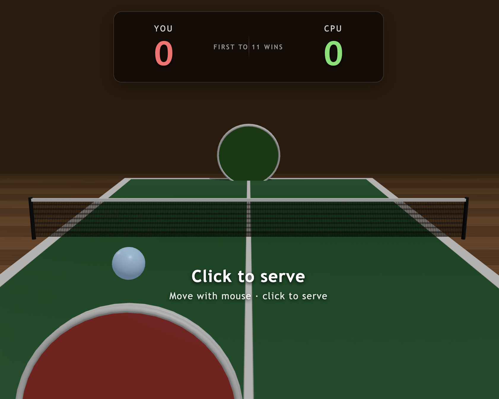

# Ping Pong 3D

A browser-based 3D ping pong game inspired by the classic Flash-era ping pong games. Built with React, TypeScript, and Three.js. Single player vs. an AI opponent, first to 11 wins.



## Documentation

- **[README.md](README.md)** (this file) — what the project is and how to run it
- **[spec.md](spec.md)** — functional and non-functional requirements with stable identifiers, used as the contract for what the app does
- **[dev-notes.md](dev-notes.md)** — high-level technical overview for contributors: rendering layers, game loop, physics, AI, audio, build pipeline

## Features

- 3D scene with a wood-floor environment, green table with painted lines, brown grid net, and round paddles
- Realistic ball physics: gravity, table bounces, net collisions, and paddle returns with english (spin from off-center hits)
- Standard ping pong service / rally rules:
  - Serve must bounce on the server's own side first, then the receiver's side
  - During rally, each shot must bounce on the opponent's side before they return
  - Volley faults, double-bounce faults, and out-of-bounds are detected and scored
- AI opponent that tracks the ball and predicts where it will land (configurable difficulty)
- Procedurally generated sound effects via the Web Audio API — paddle hits, table bounces, net thuds, score chimes, win fanfare
- HUD with live scoreboard, score-flash animation, mute toggle, and end-of-match overlay
- Ball-tracking marker on the table that grows and fades with ball altitude, helping you read the ball's `x` lane mid-flight

## Tech stack

| Layer | Choice |
| --- | --- |
| Build tool | Vite 5 |
| UI shell | React 18 + TypeScript |
| 3D rendering | Three.js |
| Audio | Web Audio API (synthesized in-browser, no asset files) |
| Backend | None — fully client-side |

## Requirements

- Node.js 18+
- npm 9+ (or pnpm / yarn — adjust commands accordingly)

## Getting started

Clone the repository and install dependencies:

```bash
git clone <your-repo-url> ping-pong
cd ping-pong
npm install
```

### Development server

Starts Vite with hot-module reload:

```bash
npm run dev
```

Open http://localhost:5173/ in your browser.

### Production build

Type-checks the project and produces an optimized bundle in `dist/`:

```bash
npm run build
```

### Preview the production build

Serves the contents of `dist/` locally:

```bash
npm run preview
```

## How to play

| Action | Control |
| --- | --- |
| Move paddle | Move the mouse |
| Serve | Click |
| Mute / unmute | Click the **Sound** button (top right) |
| Restart after a match | Click **Play again** on the game-over screen |

### Rules

- First to **11 points** wins the match.
- On serve, the ball must bounce on your side first, then on the opponent's side.
- After a rally hit, your shot must bounce on the opponent's side before they hit it.
- Hitting before the ball bounces on your side (a volley) is a fault.
- Failing to return before the ball bounces twice on your side is a fault.

## Project structure

```
ping-pong/
├── src/
│   ├── App.tsx                 # Top-level shell
│   ├── App.css                 # Global + HUD styles
│   ├── main.tsx                # React entry point
│   ├── components/
│   │   └── GameCanvas.tsx      # React host that mounts Game and renders the HUD
│   └── game/
│       ├── Game.ts             # Three.js scene, physics, collisions, AI, scoring
│       └── Sound.ts            # Web Audio sound manager (synthesized SFX)
├── index.html
├── package.json
├── tsconfig.json
├── vite.config.ts
├── README.md                   # This file
├── spec.md                     # Functional and non-functional requirements
└── dev-notes.md                # Technical overview for contributors
```

`Game.ts` is the heart of the game — it owns the Three.js scene, the per-frame `requestAnimationFrame` loop, ball physics, paddle collision detection, the bounce-side rules, and the AI controller. The React layer only mounts the canvas and renders the HUD; per-frame state lives in refs/instance fields, not React state.

For a deeper dive into how the rendering layers, game loop, physics, AI, and audio fit together, see **[dev-notes.md](dev-notes.md)**.

## Tuning knobs

The most useful constants live at the top of [`src/game/Game.ts`](src/game/Game.ts):

| Constant | Effect |
| --- | --- |
| `WIN_SCORE` | Points needed to win the match |
| `AI_BASE_SPEED` | AI paddle movement speed; lower = easier |
| `AI_REACTION_NOISE` | AI aim error in world units; higher = easier |
| `PADDLE_HIT_R` | Paddle hit-zone radius (independent of visual disc size) |
| `GRAVITY` | World gravity applied to the ball |
| `TABLE_RESTITUTION` / `NET_RESTITUTION` / `PADDLE_RESTITUTION` | Energy retained on each kind of bounce |
| `DEBUG` | When `true`, logs every paddle hit / miss / bounce / fault to the browser console |

Rally and serve velocities are set inside `Game.ts` in the `serve()` method and the paddle-hit code path inside `tryPaddleHit()`.

## Notes and known limitations

- No spin physics beyond simple english from off-center paddle contact — the ball does not curve in flight.
- Mobile / touch tuning is minimal; pointer events work but the camera and HUD have only been tested on desktop.
- Single player only. Multiplayer would require a backend (e.g., WebSockets) — none is included.
- Audio is generated programmatically; no `.wav` / `.mp3` assets are bundled.

## License

MIT — see [LICENSE](LICENSE) if present, or add one before publishing.
